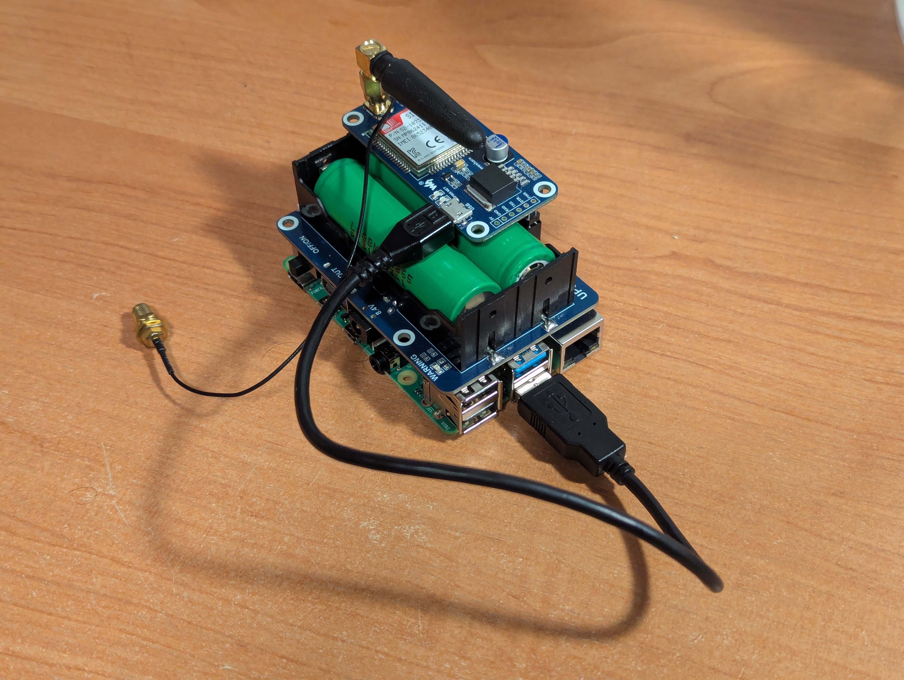

# StratosphericBalloon
Hardware stratospheric balloon localization module with server. 

# Hardware
- SIM7000E LTE GPS HAT - Waveshare 14865 
- UPS HAT - Waveshare 18306
- SIM card
- Raspbery Pi 4B
- Server

# Repository structure
```
.
├── LICENSE
├── raspberry_pi
│   ├── gps2402.py
│   └── README.md       # more information about device side software
├── README.md           # you are here ;)
└── server
    ├── api.php
    ├── config.php
    ├── get_data.php
    ├── index.php
    └── README.md       # more information about server side software
```

# Appearance
