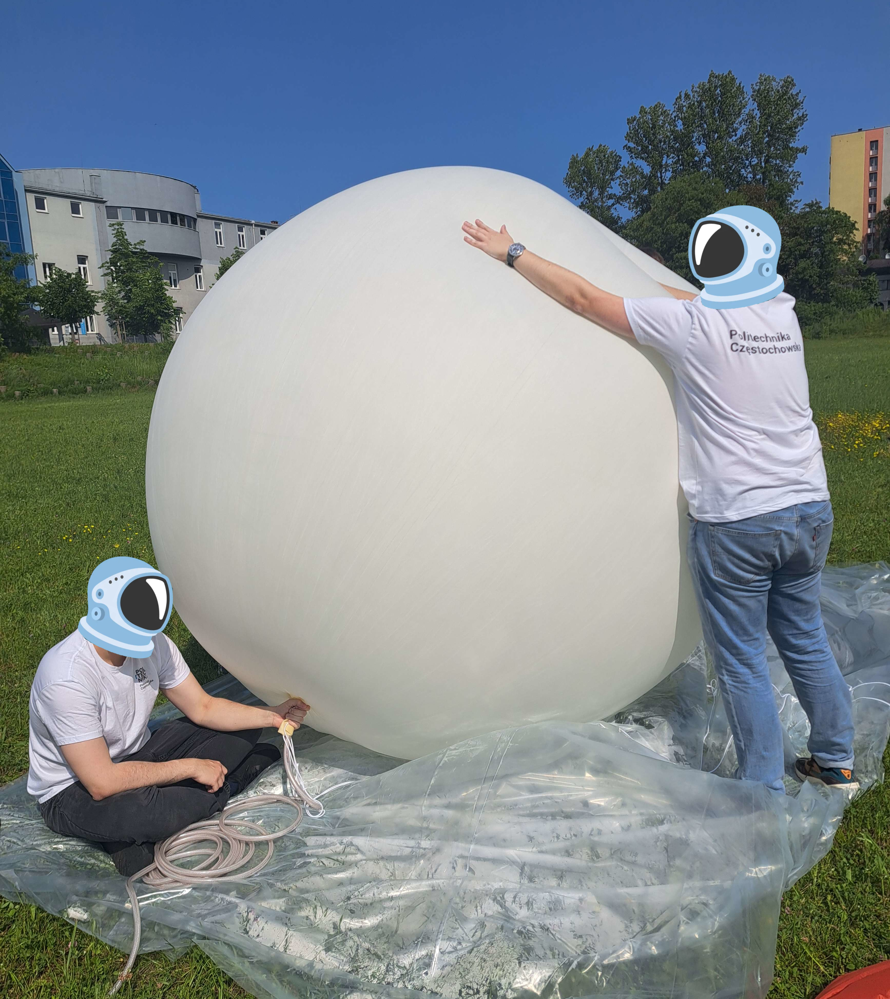
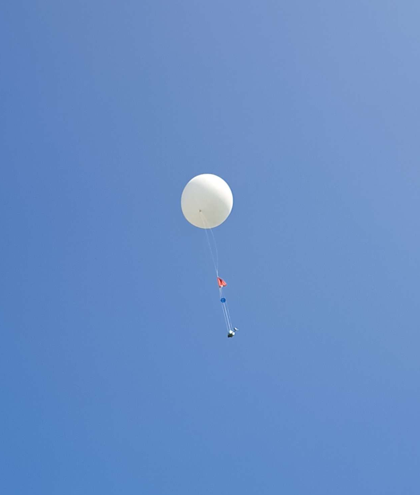

# StratosphericBalloon
Hardware stratospheric balloon localization module with server. 

## Table of Contents
* [General info](#general-info)
* [Technologies Used](#technologies-used)
* [Hardware](#hardware)
* [Repository Structure](#repository-structure)
* [Appearance](#appearance)
* [Project Status](#project-status)


## General Info
Project for a stratospheric balloon locator module that allows tracking its position from a website

## Technologies Used
* Python version: 3.12
* Php
* JavsScript
* Linux


## Hardware
- SIM7000E LTE GPS HAT - Waveshare 14865 
- UPS HAT - Waveshare 18306
- SIM card
- Raspbery Pi 4B
- Server

## Repository Structure
```
.
├── LICENSE
├── raspberry_pi
│   ├── gps2402.py
│   └── README.md       # more information about device side software
├── README.md           # you are here ;)
└── server
    ├── api.php
    ├── config.php
    ├── get_data.php
    ├── index.php
    └── README.md       # more information about server side software
```

## Appearance
Location module

Balloon load

Preparations before take-off

Starting moment

Camera view 30 km above ground

Landing site

Landing place on the map


## Project Status
The project was completed, and the balloon launch itself was successful. According to the plan, it rose to a height of about 30 km above the ground, then fell by parachute. After all, thanks to the GPS module, it was possible to find it, the balloon itself covered a distance of about 100 km and flew for 3 hours.